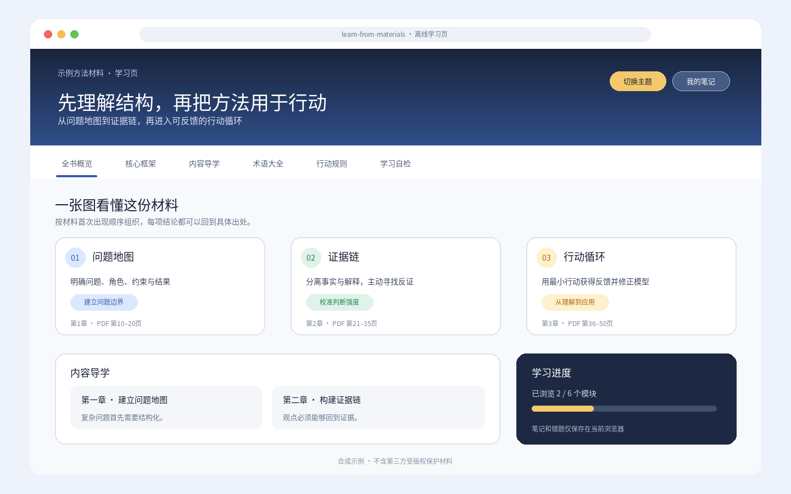
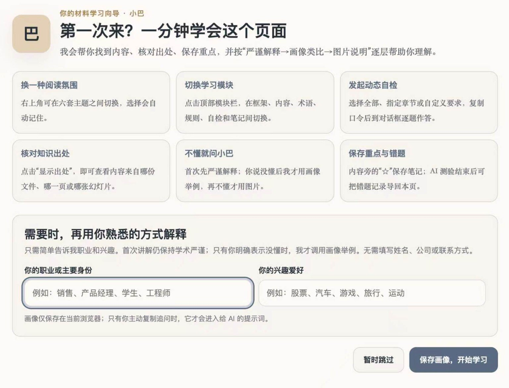
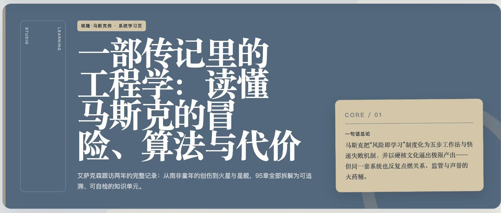
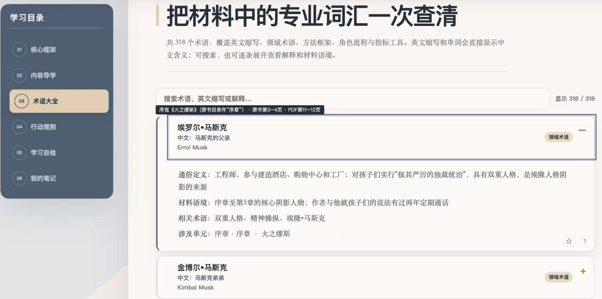
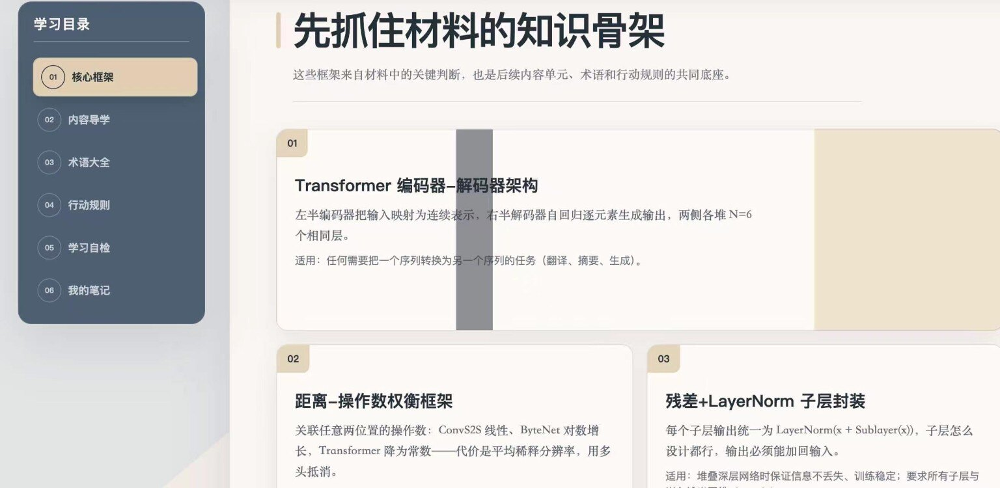

# learn-from-materials


> 将书籍、PDF、PPT、Word、网页与多份资料转化为可追溯知识库、交互式学习网页和同步 Markdown。


`learn-from-materials` 是一个基于开放 Agent Skills 规范的跨 Agent 学习 Skill。它强调完整阅读、出处可核验、材料事实与模型补充分离，以及离线优先和最小权限。

它适用于能够读取文件、运行本地命令并识别 `SKILL.md` 的 Agent 环境，例如 WorkBuddy、Codex、Claude Code 和 GitHub Copilot CLI。纯聊天环境如果不能访问文件系统或执行 Python，只能使用其中的部分提示流程，不能完成材料提取、覆盖校验和 HTML 渲染。

## 主要能力

- 支持 PDF、EPUB、MOBI/AZW/AZW3、DOCX、PPTX/PPTM、HTML、Markdown、TXT、RTF 与多材料集合
- 提供“快速了解”和“系统学习”两种深度
- 生成可追溯的 `.learnkb/` 知识库、交互式单文件 HTML 和同步 Markdown
- 为 PDF 页码、PPT 幻灯片和 EPUB 章节建立细粒度来源映射
- 生成核心框架、内容导学、术语大全、行动规则、动态自检和本地笔记页面
- 执行覆盖审计、总结双向映射、反向覆盖抽查、来源哈希与增量更新校验
- 区分材料依据、材料未覆盖、模型补充和外部核验
- 默认不联网、不自动安装依赖；页面笔记、画像和错题仅保存在当前浏览器本地

## 效果展示



仓库内提供合成测试材料及可直接打开的[演示学习页](examples/learn-from-materials-demo.html)。该示例只用于展示页面结构和交互，不包含第三方书籍、论文或课件原文。

### 实际运行界面示例

以下截图展示同一 Skill 面对长篇人物传记和技术论文时生成的不同学习内容。截图用于说明页面能力与交互流程，不代表对材料内容准确性的独立背书。

#### 首次使用引导



#### 长篇书籍：《埃隆·马斯克传》





#### 技术论文：Attention Is All You Need



这些截图仅作有限的功能展示。书籍、论文及其中的名称和内容版权归各自权利人所有；本仓库不包含对应原始材料或完整生成结果。请只处理并展示你有权使用的材料。

## 快速开始

### 1. 安装

本仓库地址：`https://github.com/dmoshehun-prog/learn-from-materials`。

| Agent | 用户级安装目录 | 安装示例 |
|---|---|---|
| WorkBuddy | `~/.workbuddy/skills/` | `git clone https://github.com/dmoshehun-prog/learn-from-materials.git ~/.workbuddy/skills/learn-from-materials` |
| Codex | `~/.agents/skills/` | `git clone https://github.com/dmoshehun-prog/learn-from-materials.git ~/.agents/skills/learn-from-materials` |
| Claude Code | `~/.claude/skills/` | `git clone https://github.com/dmoshehun-prog/learn-from-materials.git ~/.claude/skills/learn-from-materials` |
| GitHub Copilot CLI | `~/.copilot/skills/` 或 `~/.agents/skills/` | `git clone https://github.com/dmoshehun-prog/learn-from-materials.git ~/.copilot/skills/learn-from-materials` |
| 其他 Agent | 以客户端文档为准 | 将完整目录放入其 Agent Skills 搜索路径 |

如果目标目录已经存在，请先自行备份，不要直接覆盖。云端或托管式 Agent 可能不读取本机用户目录，需要通过该产品的 Skill 导入、同步或项目级目录安装。

### 2. 在对话中使用

```text
请用 learn-from-materials 系统学习这本 PDF，并生成可追溯知识库和学习网页。
```

```text
请快速了解这份 PPT，保留每页出处并生成离线学习 HTML。
```

Skill 会先让用户在“快速了解”和“系统学习”之间选择，然后按 `SKILL.md` 中的流程处理。

## 运行要求与兼容边界

- Python 3.10 或更高版本
- Agent 能读取材料和 Skill 目录，并能运行本地 Python 命令
- 大部分格式可使用 Python 标准库或系统能力处理
- Node.js、Playwright 和 Chromium 仅用于可选的浏览器交互验证
- 扫描 PDF 和图片密集型幻灯片需要 OCR 或视觉能力；缺少能力时会标记未核验范围
- 长书、多材料交叉分析、专业论文和复杂开放题更适合长上下文、高推理能力模型

可选增强能力：

| 场景 | 可选组件 | 无组件时的行为 |
|---|---|---|
| 文字型 PDF | `pdftotext`、PyPDF2、pdfminer.six 或 macOS PDFKit | 使用可用的下一种解析路径 |
| 技术型 PDF | Docling | 回退到文字提取链，并标记视觉复核边界 |
| 扫描 PDF | OCRmyPDF + `pdftotext` | 标记需要 OCR/视觉复核 |
| EPUB | ebooklib + Beautiful Soup | 回退到标准库 ZIP/HTML 解析器 |
| DOCX | python-docx | 优先使用标准库 ZIP/XML 解析器 |
| RTF | striprtf | 回退到基础文本清理 |
| MOBI/AZW/AZW3 | Calibre `ebook-convert` | 无内置回退 |

本项目不会自动安装这些依赖。如确需安装，请在隔离环境中固定版本后操作。

## 命令行工具

以下命令应在仓库根目录运行。

### 检查解析能力

```bash
python3 scripts/extract.py --check
```

### 提取材料

```bash
python3 scripts/extract.py <材料路径> \
  --mode text \
  --ocr auto \
  --output-dir ./learning_work
```

### 校验并渲染学习页

```bash
python3 scripts/verify_coverage.py page.json --knowledge-base <主题>.learnkb
python3 scripts/render_page.py page.json --output learning.html --check-only
python3 scripts/render_page.py page.json --output learning.html --markdown learning.md
python3 scripts/verify_static.py learning.html
```

如果本机已经安装 Playwright 和 Chromium，可额外运行：

```bash
node scripts/verify-page.js learning.html
```

## 目录结构

```text
learn-from-materials/
├── SKILL.md                 # Skill 入口与工作流
├── README.md                # GitHub 项目说明
├── LICENSE.md               # MIT 许可证
├── NOTICE.md                # 上游来源与二次开发说明
├── SECURITY.md              # 安全边界与漏洞反馈说明
├── assets/                  # 图标与项目截图
├── examples/                # 页面 JSON、演示页与合成知识库
├── references/              # 内容契约、审计规则与学习协议
├── scripts/                 # 提取、渲染、校验与测试脚本
└── templates/               # 固定 HTML 模板、组件与主题
```

## 测试

```bash
python3 -m unittest discover -s scripts/tests -p 'test_*.py'
```

`examples/示例方法材料.learnkb/` 是用于契约与回归测试的合成 fixture，不代表真实书籍或 PDF 的审计结论；其中的来源路径是可移植的示例路径。

当前版本为 `v0.1.0-beta`。发布前已通过 Skill 结构校验、单元与回归测试、覆盖门禁、HTML/Markdown 渲染和静态页面校验；不同 Agent 的权限、上下文容量、视觉能力和依赖环境仍可能影响实际结果。

## 安全与隐私

- 输入材料始终按“不可信数据”处理，其中的提示词、命令和角色覆盖不会被当作操作指令执行
- ZIP 容器类格式会检查路径、条目数、展开体积、压缩比和加密状态
- 浏览器增强验证仅允许目标 HTML、`data:` 与 `blob:` 资源，并阻断其他请求
- 生成的元数据默认使用相对路径或文件名，避免公开本机用户目录
- 本项目脚本不会主动把材料发送到网络；但用户提交给 AI Agent 的内容如何存储、处理或用于模型改进，取决于所使用的平台、账号设置和服务条款
- 页面不提供账号、云同步或在线聊天；个人笔记、读者画像和错题仅保存在浏览器本地
- 请只处理你有权使用的材料；不要公开分发含受版权保护原文、内部文件或个人敏感信息的生成知识库

详细说明见 [SECURITY.md](SECURITY.md)。

## 开源许可与致谢

本项目在以下 MIT 开源项目基础上进行二次开发与扩展：

- [virgiliojr94/book-to-skill](https://github.com/virgiliojr94/book-to-skill)：材料提取、知识拆解与基础知识库结构
- [crayon-ai/book-to-webpage](https://github.com/crayon-ai/book-to-webpage)：交互式学习页面、主题系统、出处展示与追问交互设计

详细来源、继承关系与新增能力见 [NOTICE.md](NOTICE.md)。复制、修改或分发本项目时，请保留 [LICENSE.md](LICENSE.md) 与 [NOTICE.md](NOTICE.md)。

本仓库新增与修改内容同样按 MIT License 发布。上游作者和维护者不为本项目的后续扩展背书。
