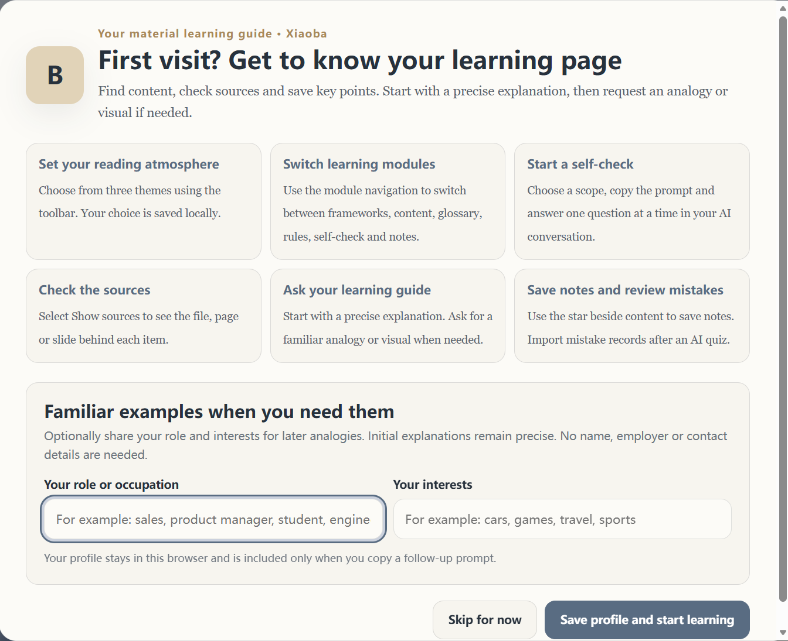
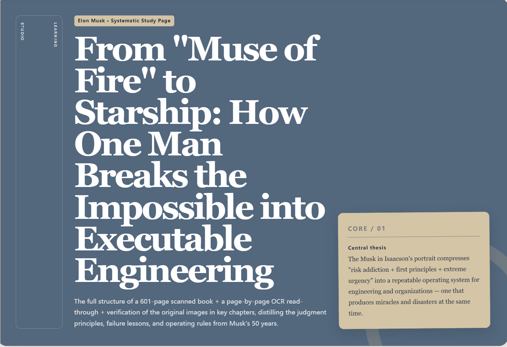
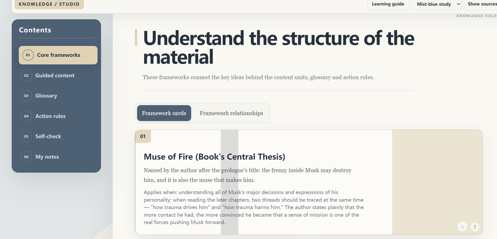
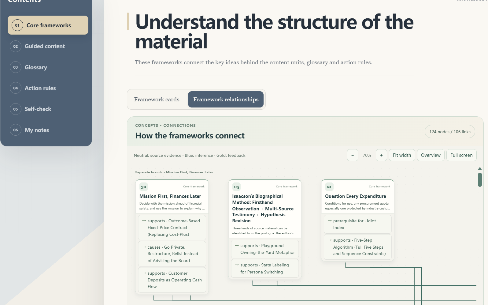
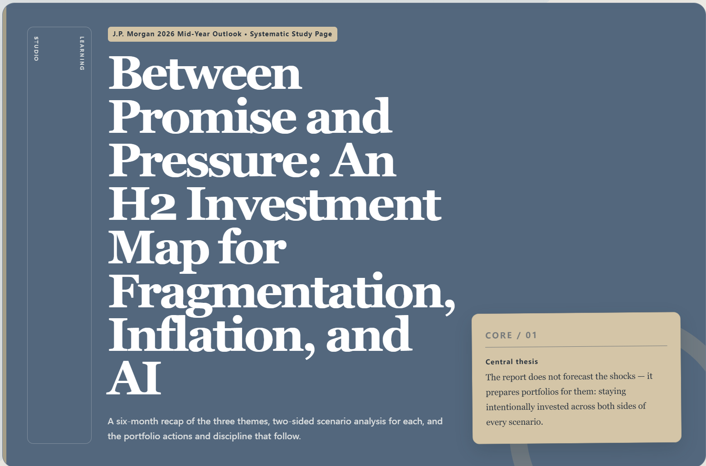
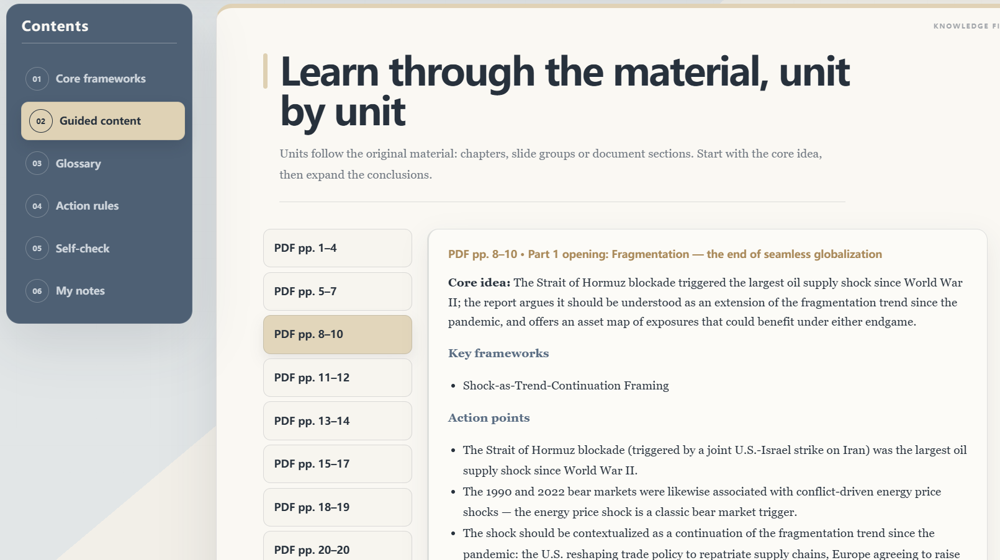
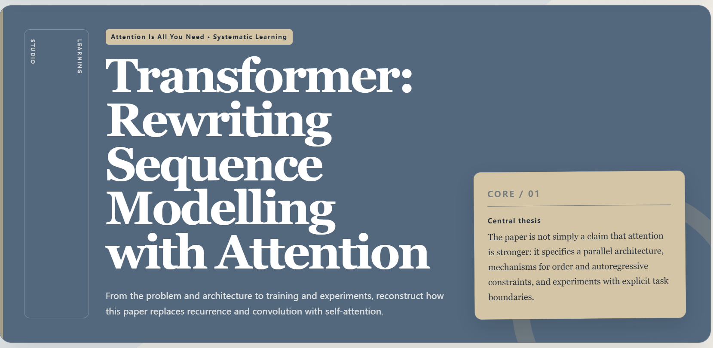
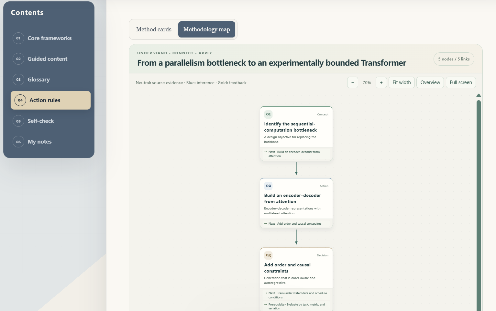

**English** · [中文](README_CN.md)
# learn-from-materials


> Turn books, PDFs, slides, Word documents, web pages, and multi-file material sets into traceable knowledge bases, interactive learning pages, and synced Markdown.


`learn-from-materials` is a cross-agent learning skill built on the open Agent Skills specification. It emphasizes complete reading, verifiable sources, a strict separation between material facts and model-added content, offline-first operation, and least privilege.

It works in agent environments that can read files, run local commands, and recognize `SKILL.md` — such as WorkBuddy, Codex, Claude Code, and GitHub Copilot CLI. Pure chat environments without file-system access or Python execution can only use parts of the prompting workflow; they cannot perform material extraction, coverage validation, or HTML rendering.

## Key Features

### A Methodology That Spans the Whole Material

It starts by extracting the material's central question and its goal, then organizes the argument, frameworks and action rules into one complete structure. It supports the main flow, decision branches, causal and hierarchical relations, and evidence-backed feedback loops; it does not fix a step count and does not force every material into an eight-step process. The overview is not split into groups by node count, and selecting a node shows its inputs, actions, outputs, check conditions, related learning units and sources.

The whole structure is also saved separately as `methodology.json` / `methodology.md`, keeping what the source material itself does clearly distinct from the whole-material synthesis. "Apply This Methodology" carries the entire structure by default, letting the AI locate your entry point and advance you condition by condition; a single card can still be chosen instead.

Guided content shows source hints for core ideas, key points and conclusions on mouse hover and on keyboard focus, plus an expandable "Source" panel for touch screens. These stay available after switching units. When a verified fine-grained location exists, the matching page number is displayed; otherwise the unit-level or conclusion-level range is reported as-is.

See the [whole-material methodology protocol](references/whole-material-methodology.md) and the [runnable paper example](examples/overview-whole-methodology.json). That example demonstrates the new structure and interaction; its body reuses the earlier guided summary, so the number of example entries is not an extraction ceiling for systematic study.

### An Accumulating Method Library

After parsing new material, reusable methods are saved to the knowledge base's `methods.json`, and a readable `patterns.md` is generated from it. Each card records purpose, prerequisites, limits, steps, effect checks, a short source quotation, a stable ID and a version; when a material contains no methodology, that is stated plainly rather than invented.

Page bindings and the method prompts are derived from that same data. Several method files you designate can be indexed cumulatively, candidate methods can be found by Chinese or English keywords, and comparison records can be exported. Original methods and earlier versions are retained; a synthesized method receives a new ID and an explicit parent-method reference, and never silently overwrites or blends into what the material actually meant.

See the [method library protocol and commands](references/method-library.md), the [example method file](examples/methods-demo.learnkb/methods.json), the [readable method cards](examples/methods-demo.learnkb/patterns.md) and the [demo page bound to a method library](examples/methods-library-demo.html). The earlier Chinese and English versions, the relationship maps and "Apply This Methodology" all remain available.

### Language and In-Page Interaction

- **Follows your language**: an explicit instruction comes first, then the current request and the conversation; Chinese and English are supported for body text, the interface, Markdown and copyable prompts. Original quotations and source names are preserved. Language is never guessed from nationality or browser locale, and existing HTML is never auto-translated.
- **Logical relationship maps**: the core framework switches between cards and a framework relationship map; the action rules present the whole-material methodology. You can inspect why each dependency, application or feedback link exists and where it comes from, with inference set apart by color; all nodes live on one canvas.
- **Apply This Methodology**: enter your question, goal and constraints, pick a specific method or let it match automatically, and get a prompt you can copy into a conversation about the material. It judges applicability first and only then gives sourced analysis and suggested actions; the page never calls an AI directly.

- Supports PDF, EPUB, MOBI/AZW/AZW3, DOCX, PPTX/PPTM, HTML, Markdown, TXT, RTF, and multi-material collections
- Two learning depths: "Quick Overview" and "Systematic Study"
- Generates a traceable `.learnkb/` knowledge base, a self-contained interactive HTML page, and synced Markdown
- Fine-grained source mapping for PDF pages, PPT slides, and EPUB chapters
- Produces core-framework, guided-content, glossary, action-rules, dynamic self-check, and local-notes pages
- Runs coverage audits, summary bidirectional mapping, reverse coverage spot checks, source hashing, and incremental-update validation
- Distinguishes material-backed facts, areas not covered by the material, model-added content, and externally verified items
- Offline by default with no automatic dependency installation; page notes, learner profiles, and wrong-answer records stay in the local browser only

## Showcase

The following examples show learning pages generated from three types of material, in order: a biography, a financial market outlook report, and a research paper. Each set of screenshots highlights selected sections of the same six-module learning-page format; it does not show every section of each page.

### 1. Biography — *Elon Musk*

The first-run guide introduces the modules and optional local learner profile. The generated page then moves from a material-level thesis to framework cards and their relationship map.

**First-run learning guide**



**Systematic-study cover**



**Core-framework cards**



**Framework relationship map — partial view**



### 2. Financial market outlook report — J.P. Morgan 2026 Mid-Year Outlook

This example shows that the same workflow can organize a financial outlook PDF into a systematic learning page. The guided-content view preserves PDF page ranges while separating a unit's core idea, key frameworks and action points.

**Systematic-study cover**



**Guided content with PDF page ranges**



### 3. Research paper — *Attention Is All You Need*

The paper example shows a research argument recast as a learning page and an explicitly bounded methodology map. The map screenshot is a partial view of the page, not the full graph.

**Systematic-study cover**



**Methodology map — partial view**



These screenshots demonstrate interface organization, not an independent verification of each claim, citation or generated conclusion. Source texts and screenshots remain subject to their respective rights holders; this repository does not include the original materials or the full generated results. Only process and display materials you have the rights to use. For a synthetic, source-free walkthrough, open the [whole-methodology demo](examples/whole-methodology-demo.html) or the [English feature demo](examples/features-en.html).

## Getting Started

### 1. Installation

Repository URL: `https://github.com/dmoshehun-prog/learn-from-materials`.

| Agent | User-level install directory | Example |
|---|---|---|
| WorkBuddy | `~/.workbuddy/skills/` | `git clone https://github.com/dmoshehun-prog/learn-from-materials.git ~/.workbuddy/skills/learn-from-materials` |
| Codex | `~/.agents/skills/` | `git clone https://github.com/dmoshehun-prog/learn-from-materials.git ~/.agents/skills/learn-from-materials` |
| Claude Code | `~/.claude/skills/` | `git clone https://github.com/dmoshehun-prog/learn-from-materials.git ~/.claude/skills/learn-from-materials` |
| GitHub Copilot CLI | `~/.copilot/skills/` or `~/.agents/skills/` | `git clone https://github.com/dmoshehun-prog/learn-from-materials.git ~/.copilot/skills/learn-from-materials` |
| Other agents | See your client's documentation | Place the full directory in its Agent Skills search path |

If the target directory already exists, back it up yourself first — do not overwrite it directly. Cloud or hosted agents may not read local user directories; install through that product's skill import, sync, or project-level directory mechanism instead.

### 2. Use It in a Conversation

```text
Please use learn-from-materials to systematically study this PDF and generate a traceable knowledge base and a learning page.
```

```text
Give me a quick overview of this PPT, keep per-slide sources, and generate an offline learning HTML.
```

The skill first asks you to choose between "Quick Overview" and "Systematic Study", then follows the workflow defined in `SKILL.md`.

## Requirements & Compatibility

- Python 3.10 or later
- An agent that can read materials and the skill directory and run local Python commands
- Most formats can be handled with the Python standard library or system capabilities
- Node.js, Playwright, and Chromium are used only for optional browser interaction verification
- Scanned PDFs and image-heavy slides require OCR or vision capabilities; when unavailable, affected ranges are flagged as unverified
- Long books, multi-material cross-analysis, specialized papers, and complex open-ended questions work best with long-context, high-reasoning models

Optional enhancements:

| Scenario | Optional component | Behavior without it |
|---|---|---|
| Text-based PDFs | `pdftotext`, PyPDF2, pdfminer.six, or macOS PDFKit | Falls back to the next available parsing path |
| Technical PDFs | Docling | Falls back to the text extraction chain and flags visual-review boundaries |
| Scanned PDFs | OCRmyPDF + `pdftotext` | Flagged as needing OCR/visual review |
| EPUB | ebooklib + Beautiful Soup | Falls back to the standard-library ZIP/HTML parser |
| DOCX | python-docx | Standard-library ZIP/XML parser preferred |
| RTF | striprtf | Falls back to basic text cleanup |
| MOBI/AZW/AZW3 | Calibre `ebook-convert` | No built-in fallback |

This project never installs these dependencies automatically. If you truly need them, install pinned versions in an isolated environment.

## Command-Line Tools

Run the following commands from the repository root.

### Check parsing capabilities

```bash
python3 scripts/extract.py --check
```

### Extract materials

```bash
python3 scripts/extract.py <material-path> \
  --mode text \
  --ocr auto \
  --output-dir ./learning_work
```

### Validate and deliver a learning page

```bash
python3 scripts/verify_coverage.py page.json --knowledge-base <topic>.learnkb
python3 scripts/render_page.py page.json --output learning.html --check-only
python3 scripts/finalize.py page.json --knowledge-base <topic>.learnkb --output-dir ./delivery --name learning
```

For a new systematic overview, first complete the per-unit [`action-rule-ledger.json`](references/action-rule-ledger.md). The finalizer validates and packages the HTML, Markdown and knowledge base, and exports `methodology.md` from the canonical `methodology.json`. Standalone rendering remains available for explicit re-rendering or diagnosis, but is not the complete delivery workflow. Older overviews that need repackaging have a documented legacy ledger option; do not use it for new material.

If Playwright and Chromium are installed locally, you can additionally run:

```bash
node scripts/verify-page.js learning.html
```

## Repository Layout

```text
learn-from-materials/
├── SKILL.md                 # Skill entry point & workflow
├── README.md                # English project overview
├── README_CN.md             # Chinese project overview
├── CHANGELOG.md             # Release history
├── LICENSE.md               # MIT license
├── NOTICE.md                # Upstream sources & derivative-work notes
├── SECURITY.md              # Security boundaries & vulnerability reporting
├── assets/                  # Icons & project screenshots
├── examples/                # Page JSON, demo page & synthetic knowledge base
├── references/              # Content contracts, audit rules & learning protocol
├── scripts/                 # Extraction, rendering, validation & test scripts
└── templates/               # Fixed HTML templates, components & themes
```

## Tests

```bash
python3 -m unittest discover -s scripts/tests -p 'test_*.py'
node scripts/tests/test_extensions.cjs
node scripts/test-graph-hover-wheel.cjs
python3 scripts/verify_static.py examples/features-en.html
python3 scripts/verify_static.py examples/features-zh.html
```

`examples/示例方法材料.learnkb/` is a synthetic fixture for contract and regression tests; it does not represent audit conclusions for any real book or PDF, and its source paths are portable example paths.

Current version: `v0.2.0` (pre-stable). New systematic overviews require a v2 per-unit action-rule and relationship-review ledger; systematic PDFs also require a reviewed original-heading index. Structural, citation, coverage and relationship checks do not prove that the first reading found every important idea or that a source-backed interpretation is semantically correct. Results can vary with agent permissions, context, vision capabilities and dependencies.

## Security & Privacy

- Input materials are always treated as untrusted data; prompts, commands, and role overrides found inside them are never executed as instructions
- ZIP-container formats are checked for paths, entry counts, expanded size, compression ratio, and encryption state
- Browser-based verification only allows the target HTML plus `data:` and `blob:` resources; all other requests are blocked
- Generated metadata uses relative paths or filenames by default to avoid exposing local user directories
- This project's scripts never send materials to the network; however, how content you submit to an AI agent is stored, processed, or used for model improvement depends on the platform, account settings, and terms of service you use
- Pages offer no accounts, cloud sync, or online chat; personal notes, reader profiles, and wrong-answer records are kept only in the browser's local storage
- Only process materials you have the right to use; do not publicly distribute generated knowledge bases containing copyrighted original text, internal documents, or personal sensitive information

See [SECURITY.md](SECURITY.md) for details.

## License & Acknowledgements

This project is a derivative work built on the following MIT-licensed open-source projects:

- [virgiliojr94/book-to-skill](https://github.com/virgiliojr94/book-to-skill): material extraction, knowledge decomposition, and the base knowledge-base structure
- [crayon-ai/book-to-webpage](https://github.com/crayon-ai/book-to-webpage): the interactive learning page, theme system, source display, and follow-up question interaction design

See [NOTICE.md](NOTICE.md) for detailed sources, inheritance relationships, and additions. When copying, modifying, or distributing this project, please retain [LICENSE.md](LICENSE.md) and [NOTICE.md](NOTICE.md).

New and modified content in this repository is likewise released under the MIT License. The upstream authors and maintainers do not endorse this project's subsequent extensions.
