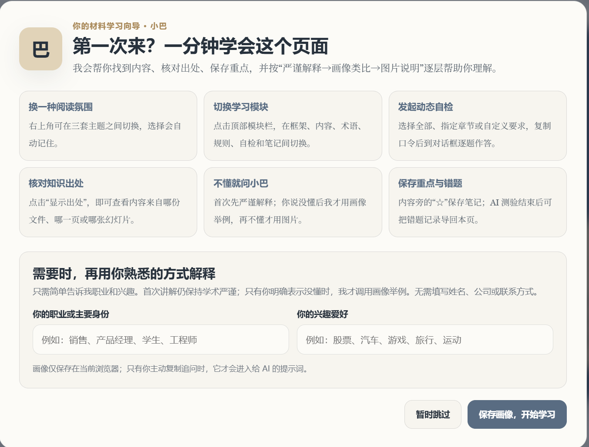
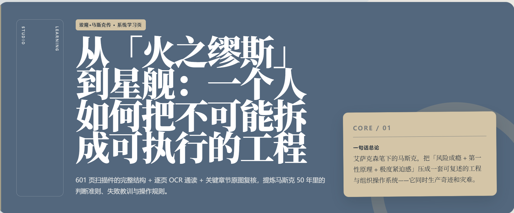
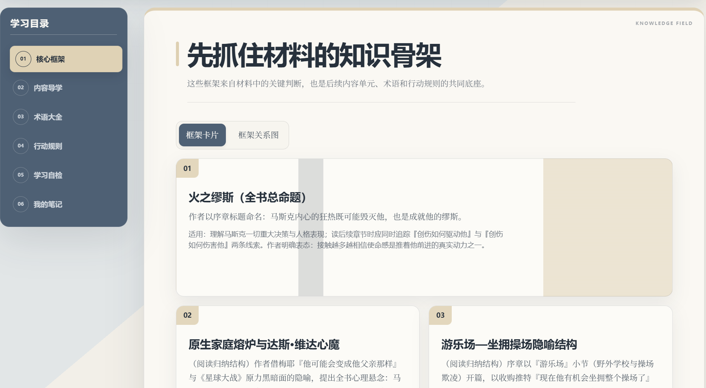
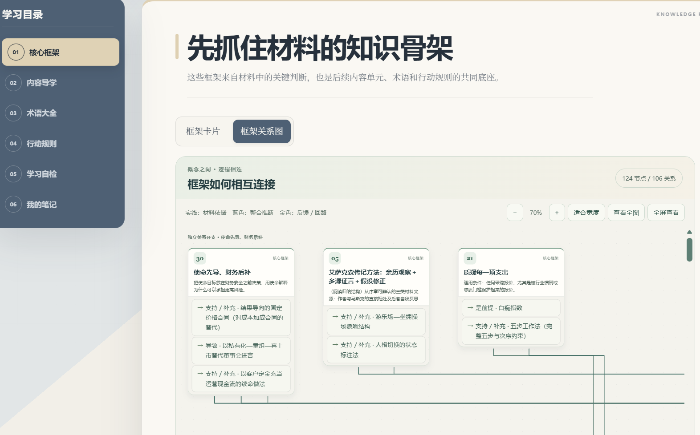
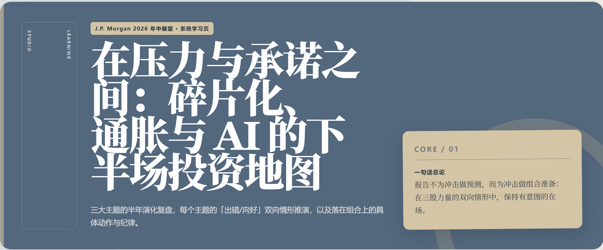
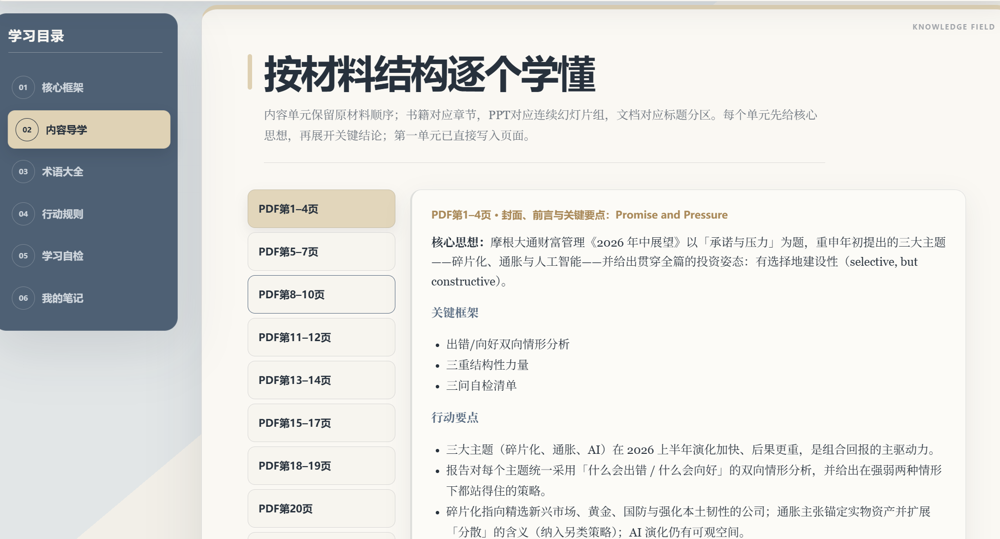
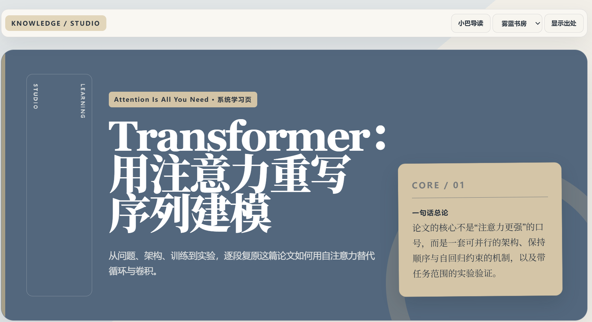
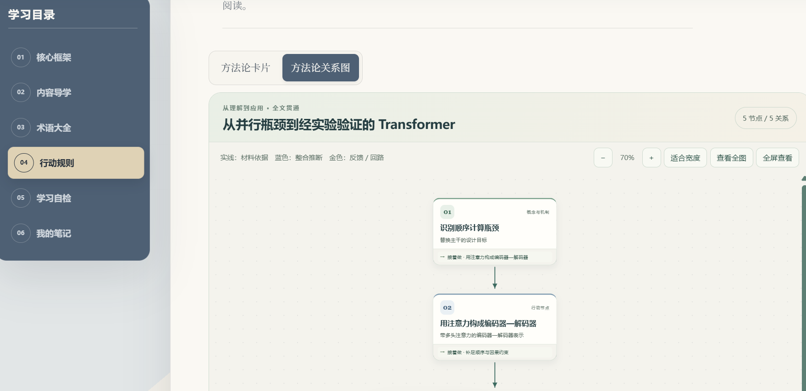

[English](README.md) · **中文**

# learn-from-materials


> 将书籍、PDF、PPT、Word、网页与多份资料转化为可追溯知识库、交互式学习网页和同步 Markdown。


`learn-from-materials` 是一个基于开放 Agent Skills 规范的跨 Agent 学习 Skill。它强调完整阅读、出处可核验、材料事实与模型补充分离，以及离线优先和最小权限。

它适用于能够读取文件、运行本地命令并识别 `SKILL.md` 的 Agent 环境，例如 WorkBuddy、Codex、Claude Code 和 GitHub Copilot CLI。纯聊天环境如果不能访问文件系统或执行 Python，只能使用其中的部分提示流程，不能完成材料提取、覆盖校验和 HTML 渲染。

## 主要能力

### 贯穿全文的方法论

先提炼材料的中心问题和目标，再将论证、框架与行动规则组织为完整结构。支持主流程、决策分支、因果与层级关系，以及有依据的反馈回路；不限定步骤数量，不把所有材料强套成八步流程。整体视图不按节点数量拆组，点击节点可查看输入、动作、产出、检查条件、关联学习单元与出处。

整体结构单独保存为 `methodology.json` / `methodology.md`，明确区分原文方法与全文整合。“一键使用方法论”默认携带整套结构，让 AI 定位用户的问题入口并按条件推进；仍可选择单张卡片。

内容导学支持核心思想、要点和结论的鼠标悬停、键盘聚焦出处提示，以及触屏可展开的“原文出处”。切换单元后保持有效。有核验的细粒度定位时显示对应页码；否则如实显示单元或结论页段。

参见[整体方法论协议](references/whole-material-methodology.md)与[可运行的论文示例](examples/overview-whole-methodology.json)。该示例是新版结构和交互演示，其正文保留此前导学摘要，不能用示例条目数量作为系统学习的提取上限。

### 可积累的方法论库

解析新材料后，将可复用方法保存到知识库的 `methods.json`，再自动生成便于阅读的 `patterns.md`。每张卡包含用途、前提、限制、步骤、效果检查、来源短引文、稳定 ID 和版本；没有方法论的材料会如实说明，不强行编造。

页面绑定与方法应用口令从同一份数据派生。可把用户指定的多个方法文件建立为累积索引，按中英文关键词找候选方法，导出比较记录。原方法和旧版本保留；综合方法使用新 ID 和明确的父方法引用，不自动覆盖或混成材料原意。

参见[方法库协议与命令](references/method-library.md)、[示例方法文件](examples/methods-demo.learnkb/methods.json)、[可读方法卡](examples/methods-demo.learnkb/patterns.md)及[绑定方法库的演示页](examples/methods-library-demo.html)。旧版中英文、关系图和“一键使用方法论”均保留。

### 语言与应用交互

- **跟随用户语言**：明确指定优先，其次看当前请求和对话；支持中文、英文正文、界面、Markdown 与复制口令。保留原文引用和来源名称。不是根据国籍或浏览器猜测语言，也不会自动翻译已有 HTML。
- **逻辑关系图**：核心框架切换卡片/框架关系图；行动规则展示整体方法论。查看依赖、应用、反馈等连线的理由和出处，用颜色区分推断；所有节点在同一画布。
- **一键使用方法论**：填写问题、目标、约束，选择具体方法或自动匹配，生成可复制到材料对话的口令。先判断适用性，再给出有出处的分析与行动建议；页面不直接调用 AI。

- 支持 PDF、EPUB、MOBI/AZW/AZW3、DOCX、PPTX/PPTM、HTML、Markdown、TXT、RTF 与多材料集合
- 提供“快速了解”和“系统学习”两种深度
- 生成可追溯的 `.learnkb/` 知识库、交互式单文件 HTML 和同步 Markdown
- 为 PDF 页码、PPT 幻灯片和 EPUB 章节建立细粒度来源映射
- 生成核心框架、内容导学、术语大全、行动规则、动态自检和本地笔记页面
- 执行覆盖审计、总结双向映射、反向覆盖抽查、来源哈希与增量更新校验
- 区分材料依据、材料未覆盖、模型补充和外部核验
- 默认不联网、不自动安装依赖；页面笔记、画像和错题仅保存在当前浏览器本地

## 效果展示

以下依次展示人物传记、金融市场展望报告和学术论文三种材料生成的学习页。每组选取同一套六板块学习页中的不同部分，并非展示每个示例的全部页面。

### 1. 人物传记：《埃隆·马斯克传》

首次使用引导介绍学习模块和仅保存在浏览器本地的可选画像。生成的页面从整本书的一句话总论，延伸到核心框架卡片及其关系图。

**首次使用引导**



**系统学习页封面**



**核心框架卡片**



**框架关系图（局部）**



### 2. 金融市场展望报告：J.P. Morgan《2026 年中展望》

这一示例展示同一流程如何把金融市场展望 PDF 整理为系统学习页。内容导学保留 PDF 页段，并分别呈现单元的核心思想、关键框架和行动要点。

**系统学习页封面**



**带 PDF 页段的内容导学**



### 3. 学术论文：《Attention Is All You Need》

论文示例展示如何把研究论证整理成学习页，并通过方法论关系图呈现有任务边界的推理结构。下图仅是图谱的局部视图。

**系统学习页封面**



**方法论关系图（局部）**



这些截图展示页面组织方式，不构成对每项论断、出处或生成结论的独立核验。原材料及截图涉及的内容版权归各自权利人所有；本仓库不包含对应原始材料或完整生成结果。请只处理并展示你有权使用的材料。如需无需原材料的合成演示，可打开[整体方法论示例](examples/whole-methodology-demo.html)或[中文版功能示例](examples/features-zh.html)。

## 快速开始

### 1. 安装

本仓库地址：`https://github.com/dmoshehun-prog/learn-from-materials`。

| Agent | 用户级安装目录 | 安装示例 |
|---|---|---|
| WorkBuddy | `~/.workbuddy/skills/` | `git clone https://github.com/dmoshehun-prog/learn-from-materials.git ~/.workbuddy/skills/learn-from-materials` |
| Codex | `~/.agents/skills/` | `git clone https://github.com/dmoshehun-prog/learn-from-materials.git ~/.agents/skills/learn-from-materials` |
| Claude Code | `~/.claude/skills/` | `git clone https://github.com/dmoshehun-prog/learn-from-materials.git ~/.claude/skills/learn-from-materials` |
| GitHub Copilot CLI | `~/.copilot/skills/` 或 `~/.agents/skills/` | `git clone https://github.com/dmoshehun-prog/learn-from-materials.git ~/.copilot/skills/learn-from-materials` |
| 其他 Agent | 以客户端文档为准 | 将完整目录放入其 Agent Skills 搜索路径 |

如果目标目录已经存在，请先自行备份，不要直接覆盖。云端或托管式 Agent 可能不读取本机用户目录，需要通过该产品的 Skill 导入、同步或项目级目录安装。

### 2. 在对话中使用

```text
请用 learn-from-materials 系统学习这本 PDF，并生成可追溯知识库和学习网页。
```

```text
请快速了解这份 PPT，保留每页出处并生成离线学习 HTML。
```

Skill 会先让用户在“快速了解”和“系统学习”之间选择，然后按 `SKILL.md` 中的流程处理。

## 运行要求与兼容边界

- Python 3.10 或更高版本
- Agent 能读取材料和 Skill 目录，并能运行本地 Python 命令
- 大部分格式可使用 Python 标准库或系统能力处理
- Node.js、Playwright 和 Chromium 仅用于可选的浏览器交互验证
- 扫描 PDF 和图片密集型幻灯片需要 OCR 或视觉能力；缺少能力时会标记未核验范围
- 长书、多材料交叉分析、专业论文和复杂开放题更适合长上下文、高推理能力模型

可选增强能力：

| 场景 | 可选组件 | 无组件时的行为 |
|---|---|---|
| 文字型 PDF | `pdftotext`、PyPDF2、pdfminer.six 或 macOS PDFKit | 使用可用的下一种解析路径 |
| 技术型 PDF | Docling | 回退到文字提取链，并标记视觉复核边界 |
| 扫描 PDF | OCRmyPDF + `pdftotext` | 标记需要 OCR/视觉复核 |
| EPUB | ebooklib + Beautiful Soup | 回退到标准库 ZIP/HTML 解析器 |
| DOCX | python-docx | 优先使用标准库 ZIP/XML 解析器 |
| RTF | striprtf | 回退到基础文本清理 |
| MOBI/AZW/AZW3 | Calibre `ebook-convert` | 无内置回退 |

本项目不会自动安装这些依赖。如确需安装，请在隔离环境中固定版本后操作。

## 命令行工具

以下命令应在仓库根目录运行。

### 检查解析能力

```bash
python3 scripts/extract.py --check
```

### 提取材料

```bash
python3 scripts/extract.py <材料路径> \
  --mode text \
  --ocr auto \
  --output-dir ./learning_work
```

### 校验并渲染学习页

```bash
python3 scripts/verify_coverage.py page.json --knowledge-base <主题>.learnkb
python3 scripts/render_page.py page.json --output learning.html --check-only
python3 scripts/finalize.py page.json --knowledge-base <主题>.learnkb --output-dir ./delivery --name learning
```

新系统学习 overview 先按[行动规则账本](references/action-rule-ledger.md)完成 `<主题>.learnkb/action-rule-ledger.json`，`finalize.py` 会校验并打包 HTML、Markdown 和知识库。快速了解仍使用原有轻量流程。仅重新打包旧版 overview 时，可明确加 `--legacy-rule-ledger`；交付清单会标明没有完成新版规则账本检查。单独渲染页面或检查静态 HTML 仍可使用 `render_page.py`、`verify_static.py`。

如果本机已经安装 Playwright 和 Chromium，可额外运行：

```bash
node scripts/verify-page.js learning.html
```

## 目录结构

```text
learn-from-materials/
├── SKILL.md                 # Skill 入口与工作流
├── README.md                # 英文项目说明
├── README_CN.md             # 中文项目说明
├── LICENSE.md               # MIT 许可证
├── NOTICE.md                # 上游来源与二次开发说明
├── SECURITY.md              # 安全边界与漏洞反馈说明
├── assets/                  # 图标与项目截图
├── examples/                # 页面 JSON、演示页与合成知识库
├── references/              # 内容契约、审计规则与学习协议
├── scripts/                 # 提取、渲染、校验与测试脚本
└── templates/               # 固定 HTML 模板、组件与主题
```

## 测试

```bash
python3 -m unittest discover -s scripts/tests -p 'test_*.py'
node scripts/tests/test_extensions.cjs
node scripts/test-graph-hover-wheel.cjs
python3 scripts/verify_static.py examples/features-en.html
python3 scripts/verify_static.py examples/features-zh.html
```

若已安装 Playwright 和浏览器，可运行 `node scripts/verify-features.js examples/features-en.html examples/features-zh.html` 做桌面/移动端增强检查。可通过 `LFM_BROWSER_EXECUTABLE` 指定已有浏览器。不会自动安装依赖。内存交互测试不等于真实浏览器验收；`verify-page.js` 保留为旧版中文完整回归脚本。

`examples/示例方法材料.learnkb/` 是用于契约与回归测试的合成 fixture，不代表真实书籍或 PDF 的审计结论；其中的来源路径是可移植的示例路径。

当前版本为 `v0.2.0`，尚非稳定版。新系统学习 overview 需要 v2 逐单元行动规则与关系复核账本；PDF 还需要核实原文标题索引。已有 4.2/4.3 页面可继续阅读，旧 v1 账本需要重新交付时使用明确的旧版选项。方法卡使用 methods-v1，整体结构使用 methodology-v1，规则账本使用 action-rule-ledger-v2。脚本检查结构、出处、覆盖映射、规则去向和关系复核记录，不代替原文语义复核。浏览器回归可运行 `node scripts/verify-methodology-page.cjs <html>`；仅使用已有依赖。不同 Agent、不同材料类型的广泛验收仍需持续开展。

## 安全与隐私

- 输入材料始终按“不可信数据”处理，其中的提示词、命令和角色覆盖不会被当作操作指令执行
- ZIP 容器类格式会检查路径、条目数、展开体积、压缩比和加密状态
- 浏览器增强验证仅允许目标 HTML、`data:` 与 `blob:` 资源，并阻断其他请求
- 生成的元数据默认使用相对路径或文件名，避免公开本机用户目录
- 本项目脚本不会主动把材料发送到网络；但用户提交给 AI Agent 的内容如何存储、处理或用于模型改进，取决于所使用的平台、账号设置和服务条款
- 页面不提供账号、云同步或在线聊天；个人笔记、读者画像和错题仅保存在浏览器本地
- 请只处理你有权使用的材料；不要公开分发含受版权保护原文、内部文件或个人敏感信息的生成知识库

详细说明见 [SECURITY.md](SECURITY.md)。

## 开源许可与致谢

本项目在以下 MIT 开源项目基础上进行二次开发与扩展：

- [virgiliojr94/book-to-skill](https://github.com/virgiliojr94/book-to-skill)：材料提取、知识拆解与基础知识库结构
- [crayon-ai/book-to-webpage](https://github.com/crayon-ai/book-to-webpage)：交互式学习页面、主题系统、出处展示与追问交互设计

详细来源、继承关系与新增能力见 [NOTICE.md](NOTICE.md)。复制、修改或分发本项目时，请保留 [LICENSE.md](LICENSE.md) 与 [NOTICE.md](NOTICE.md)。

本仓库新增与修改内容同样按 MIT License 发布。上游作者和维护者不为本项目的后续扩展背书。
